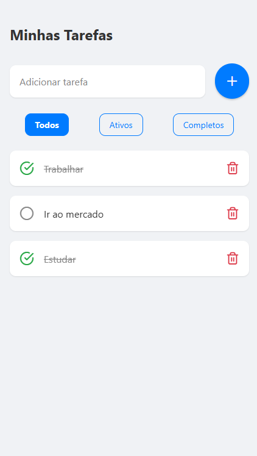

# To-Do App com Arquitetura Limpa


## 📖 Sobre o Projeto

Este é um aplicativo de lista de tarefas (To-Do) desenvolvido em React Native e Expo, com um foco especial na implementação de boas práticas de engenharia de software. O objetivo principal do projeto não era apenas criar uma ferramenta funcional, mas também construir uma base de código robusta, escalável, testável e de fácil manutenção, utilizando conceitos de **Arquitetura Limpa (Clean Architecture)** e **Clean Code**.



---

## 🏛️ Arquitetura

A estrutura do projeto segue uma adaptação do padrão **MVC (Model-View-Controller)** alinhado aos princípios da Arquitetura Limpa. A separação de responsabilidades é o pilar central:

* **Model (Core):** A camada mais interna e pura da aplicação.
  * **Domain:** Contém as entidades (`Todo`), os casos de uso (`AddTodo`, `GetTodos`, etc.) e as interfaces de repositório. Não possui nenhuma dependência de frameworks ou tecnologias externas (React Native, AsyncStorage, etc.).
  * **Infrastructure:** Implementa os detalhes técnicos, como a persistência de dados. No caso, foi criado o `AsyncStorageTodoRepository`, que implementa a interface definida no domínio.

* **View (Presentation/Components):** A camada de interface do usuário, composta por componentes React Native "burros" (dumb components) que apenas exibem dados e emitem eventos.

* **Controller (Presentation/Hooks):** A ponte entre a View e o Model. Implementado através de um Custom Hook (`useTodosController`), ele gerencia o estado da UI, chama os casos de uso apropriados e fornece os dados e ações para a View.

O fluxo de dependência segue a regra da Arquitetura Limpa: **de fora para dentro**. A camada de `Presentation` depende da de `Core`, mas a `Core` não sabe nada sobre a `Presentation`.

---

## ✨ Funcionalidades

* [x] Adicionar novas tarefas.
* [x] Marcar/desmarcar tarefas como concluídas.
* [x] Deletar tarefas.
* [x] Persistência de dados localmente (`AsyncStorage`).
* [x] Filtrar tarefas por "Todos", "Ativos" e "Completos".
* [x] Interface limpa e moderna com um sistema de design centralizado (`theme.ts`).

---

## 🚀 Como Executar o Projeto

Para rodar este projeto localmente, siga os passos abaixo:

```bash
# 1. Clone o repositório
git clone https://github.com/EstrellaRaphael/toDo-MVC.git

# 2. Navegue até a pasta do projeto
cd toDo-MVC

# 3. Instale as dependências
npm install

# 4. Inicie o servidor do Expo
npx expo start
```

---

## 🛠️ Tecnologias Utilizadas

* **React Native**
* **Expo**
* **TypeScript**
* **AsyncStorage** (para persistência local)
* **Expo Vector Icons**

## licença

Este projeto está sob a licença MIT. Veja o arquivo [LICENSE](LICENSE) para mais detalhes.
